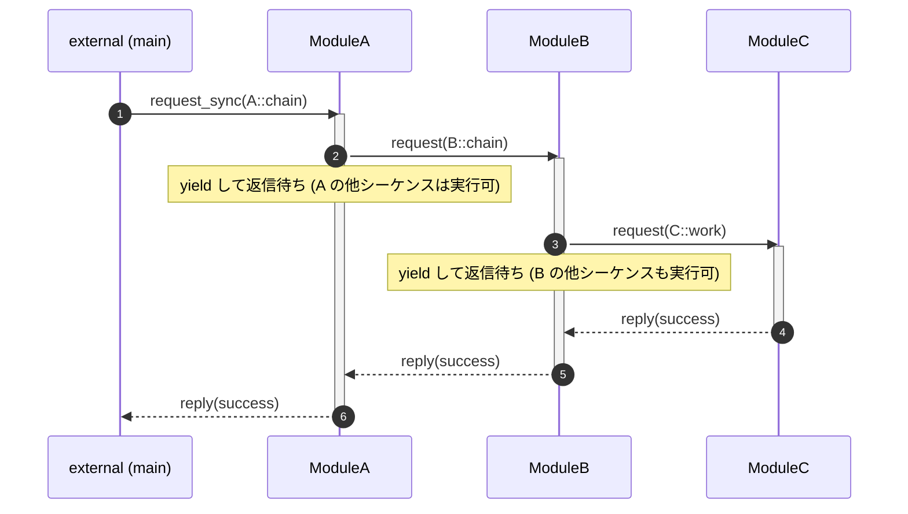
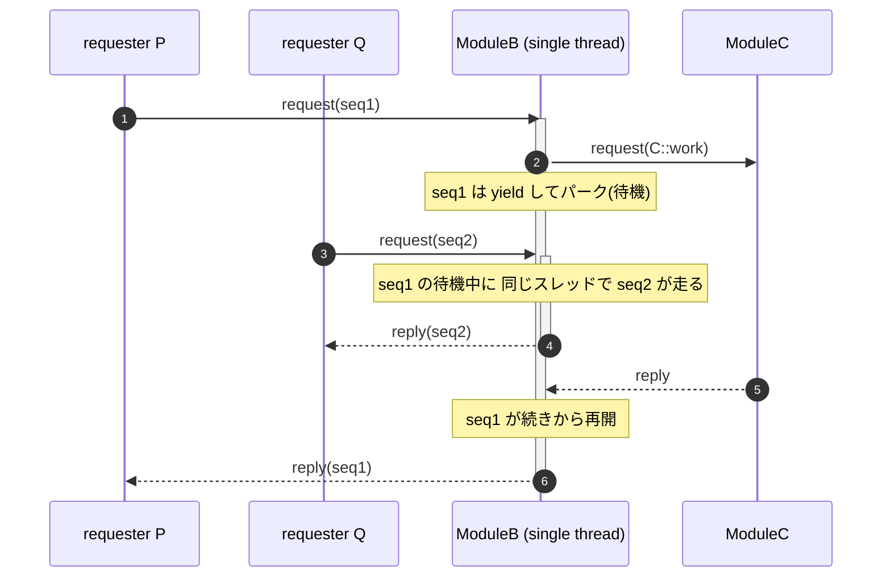
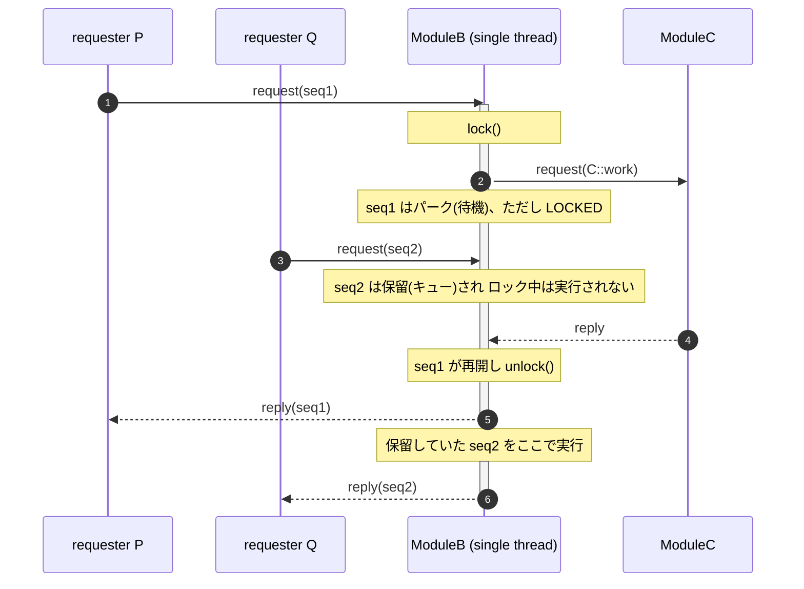

# coseq

[English](README.md) | **日本語**

[](https://github.com/ysan/coseq/actions/workflows/ci.yml) [](https://coveralls.io/github/ysan/coseq?branch=main)

**Co**routine **seq**uences — スレッド間でメッセージをやり取りする並行シーケンスを、
「一直線」のコードで書くためのフレームワーク。

coseq は非同期のスレッド間通信フレームワークで、論理的な「シーケンス」の一つ一つが
スタックフルコルーチン(fiber)です。シーケンスは他モジュールへ `request` し、
**関数を抜けずに**返信を待てます（内部で yield し、続きから再開する）。そのため:

- コードは上から下へ書ける（`switch(section_id)` の状態機械が不要）
- ローカル変数が wait をまたいで保持される
- ループは本物の `for`/`while`（「セクションへ手動で戻る」処理が不要）

スレッドは request/reply・notify(publish/subscribe)・timeout で N対N に通信します。
1スレッド内のシーケンスは協調的にスケジュールされ、切り替わるのは wait 点のみなので、
シーケンス間のロックは不要です。

> 背景: coseq は [thread_manager](https://github.com/ysan/thread_manager) の
> section/action 状態機械モデルを fiber ネイティブに置き換えた後継ですが、別実装です(別リポジトリ)。

## 構成

    coseq/       C コア (fiber スケジューラ, ucontext)     -> libcoseq.so
    coseqpp/     薄い C++ ラッパー (namespace coseq)        -> libcoseqpp.so
    samples/     C サンプル
    samplespp/   C++ サンプル

## ビルド

    $ make                       # libcoseq.so, libcoseqpp.so, testpp をビルド
    $ make -C samples   run      # C サンプル
    $ make -C samplespp run      # C++ サンプル

## インストール

    $ git clone https://github.com/ysan/coseq.git
    $ cd coseq
    $ make
    $ sudo make install INSTALLDIR=/usr/local/
    $ sudo ldconfig

インストールされるファイル:

    /usr/local/
    ├── include
    │   └── coseq
    │       ├── coseq_if.h        # C コア
    │       ├── coseqpp_if.h      # C++ ラッパー
    │       ├── coseqpp_base.h
    │       └── coseqpp.h
    └── lib
        ├── libcoseq.so
        └── libcoseqpp.so

(`INSTALLDIR` 未指定なら `./local_build` に入ります。)

アンインストール:

    $ sudo make clean INSTALLDIR=/usr/local/

## アプリケーションとのリンク

C — `<coseq/coseq_if.h>` を include し、`libcoseq` と `libpthread` をリンク:

    $ gcc myapp.c -o myapp -lcoseq -lpthread

C++ — `<coseq/coseqpp.h>` を include し、`libcoseq`・`libcoseqpp`・`libpthread` をリンク:

    $ g++ myapp.cpp -o myapp -lcoseq -lcoseqpp -lpthread -std=c++11

## テスト & カバレッジ

`testpp/` は assert ベースの C++ テストで、echo / chain / request_timeout /
fan-out / gather / notify を検証します。

    $ make                       # ビルド
    $ bash testpp/run.sh         # テスト実行 -> "ALL TESTS PASSED"

カバレッジ(gcov)は Makefile に組み込み済み。
注意: **先に `WITH_COVERAGE=1`(=`--coverage`)での計装ビルドが必須**です。
普通に `make` した後に `make gcov` だけ叩いても、計装していないと `.gcda` が生成されず何も出ません:

    $ make clean
    $ make WITH_COVERAGE=1       # lib + test を計装 (.gcno 生成)
    $ bash testpp/run.sh         # 実行 -> .gcda 生成
    $ make gcov                  # -> *.gcov, ファイルごとに Lines executed:% を表示

## ひと目で(C++)

```cpp
void chain (coseq::iface *p) {
    auto &r = p->request(MOD_B, SEQ);   // request -> wait (内部で yield)
    p->reply(coseq::result::success);   // r に返信が入る。ローカル変数も保持
}                                        // return でシーケンス終了
```

```c
/* C */
void loop (coseq_if_t *p) {
    coseq_reply(p, COSEQ_RSLT_SUCCESS, NULL, 0);
    for (;;) {                           // section の巻き戻しではなく本物のループ
        coseq_wait_timeout(p, 300);      // 300ms yield
        coseq_notify(p, CAT, msg, len);  // 購読者へ配信
    }
}
```

## シーケンス図(chain の例)

`A::chain` が `B` に、`B` が `C` に request し、返信が戻っていく。各 request は内部で yield
するため、コードは一直線のまま、待機中もそのスレッドは他のシーケンスを実行できる。



### 待機中のインターリーブ

あるシーケンスが返信待ちでパークしている間、そのスレッドは空くので、同じモジュールへの
別の request が**別のシーケンス**を実行し、その後パーク中のものが再開する。`ModuleB` の
入れ子のアクティベーションバーが、最初のシーケンスの待機中に2つ目が走っている様子を表す。
(待機中も独占したい場合は事前に `lock()` を呼ぶ。)



### `lock()` あり — インターリーブしない

待機前に `lock()` を呼ぶと、そのスレッドはロックしたシーケンスに占有される。他の request は
`unlock()` まで**保留**される。アクティベーションバーが**入れ子にならず**、seq2 は seq1 の完了後に
初めて走る点に注目。(`notify` は例外で、ロック中でも配送される。)



## API (C)

インスタンス形式 — グローバル状態なし。`create_coseq()` がハンドルを返し、
1プロセスに複数の独立インスタンスを持てます:

```c
coseq_ctx_if_t *ctx = create_coseq();
ctx->setup(ctx, tbl, n);
coseq_src_t *r = ctx->request_sync(ctx, MOD, SEQ, msg, len);   /* 外部からの要求 */
ctx->request_async(ctx, MOD, SEQ, NULL, 0);
ctx->teardown(ctx);
ctx->destroy(ctx);
```

シーケンス内(渡される `coseq_if_t *p_if` 経由。インスタンスは p_if が知っている):

- `coseq_request` / `coseq_request_timeout` — 他モジュールへ要求し、返信を待つ
- `coseq_request_async` / `coseq_wait_reply` — fan-out(投げっぱなしで `req_id` を得る)後、
  到着順に1件ずつ回収(`req_id` で突き合わせ)
- `coseq_gather` — 未消費の async 返信が*全て*揃うまで待つ
  (C++: `iface::gather_all()` は `std::vector<reply>` を返す)
- `coseq_reply` — 要求元へ返信
- `coseq_wait_timeout` — 協調的な遅延 / 周期タイマ
- `coseq_reg_notify` / `coseq_unreg_notify` / `coseq_notify` — publish/subscribe
- `coseq_lock` / `coseq_unlock` — 待機中に他シーケンスを走らせない
- `coseq_source`, `coseq_self_module` / `coseq_self_seq` / `coseq_self_user`

C++ ラッパーも同様: `coseq::manager` は(シングルトンではない)通常のオブジェクト。

## メモ

- fiber のコンテキスト切替に POSIX `ucontext` を使用(Linux)。実行中シーケンスごとに
  固定スタックを1つ確保。性能を詰めるなら libaco / 自前 asm へ差し替え可(API 不変)。

## ライセンス

MIT
