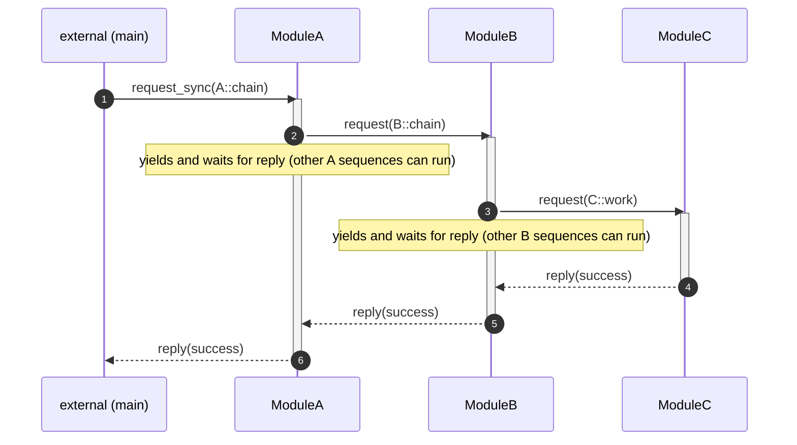
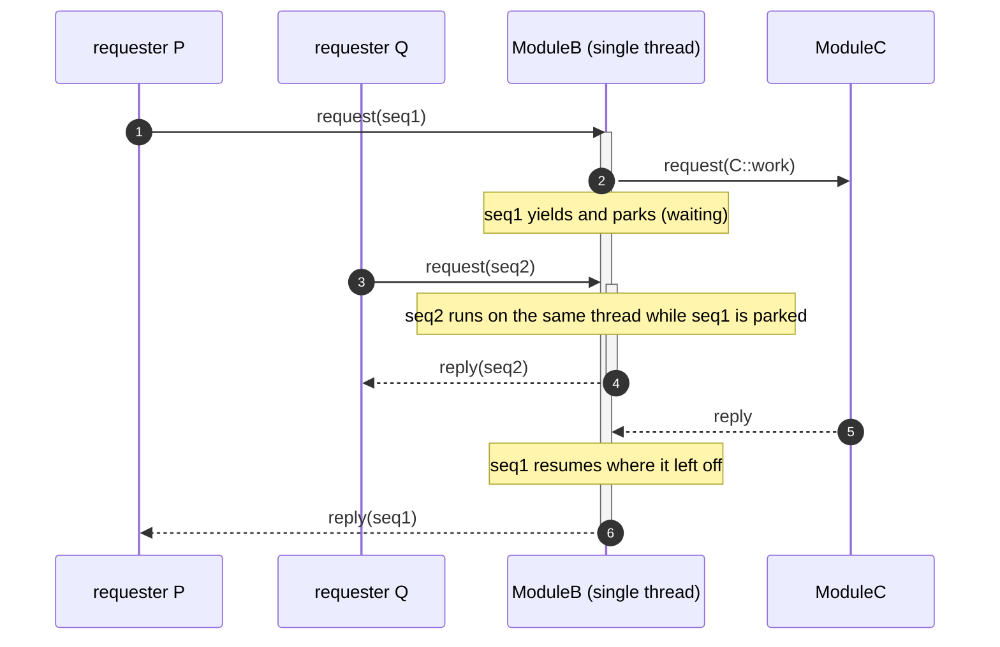
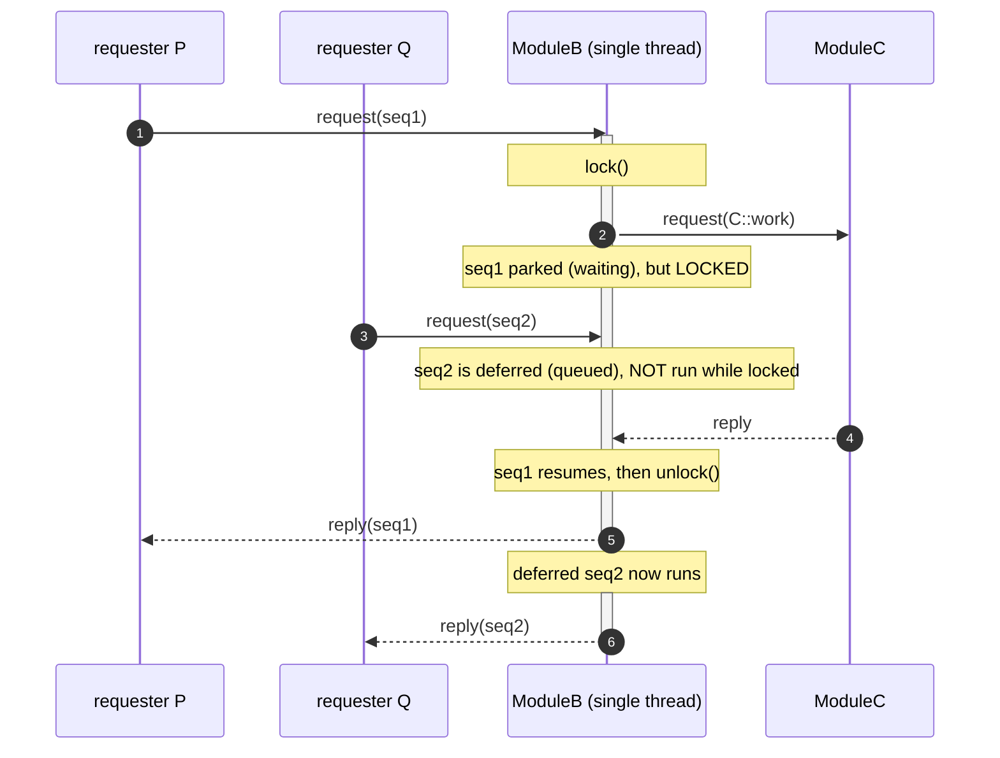

# coseq

**English** | [Japanese](README.ja.md)

[](https://github.com/ysan/coseq/actions/workflows/ci.yml) [](https://coveralls.io/github/ysan/coseq?branch=main)

**Co**routine **seq**uences — write concurrent, inter-thread message-passing sequences
as straight-line code.

coseq is an asynchronous inter-thread communication framework where each logical
"sequence" is a stackful coroutine (fiber). A sequence can `request` another module and
wait for the reply **without leaving the function** — it yields internally and resumes
where it left off, so:

- code is written top-to-bottom (no `switch(section_id)` state machines),
- local variables survive across waits,
- loops are real `for`/`while` (no manual "jump back to a section").

Threads communicate N-to-N via request/reply, notify (publish/subscribe), and timeouts.
Within one thread, sequences are cooperatively scheduled and switch only at wait points,
so no locking is needed between them.

> Background: coseq is a fiber-native successor to the section/action state-machine model
> of [thread_manager](https://github.com/ysan/thread_manager). It is a separate, greenfield
> implementation (no shared source).

## Layout

    coseq/       C core (fiber scheduler, ucontext)      -> libcoseq.so
    coseqpp/     thin C++ wrapper (namespace coseq)       -> libcoseqpp.so
    samples/     C sample
    samplespp/   C++ sample

## Build

    $ make                       # builds libcoseq.so, libcoseqpp.so, testpp
    $ make -C samples   run      # C sample
    $ make -C samplespp run      # C++ sample

## Install

    $ git clone https://github.com/ysan/coseq.git
    $ cd coseq
    $ make
    $ sudo make install INSTALLDIR=/usr/local/
    $ sudo ldconfig

Installed files:

    /usr/local/
    ├── include
    │   └── coseq
    │       ├── coseq_if.h        # C core
    │       ├── coseqpp_if.h      # C++ wrapper
    │       ├── coseqpp_base.h
    │       └── coseqpp.h
    └── lib
        ├── libcoseq.so
        └── libcoseqpp.so

(Without `INSTALLDIR` it installs to `./local_build`.)

Uninstall:

    $ sudo make clean INSTALLDIR=/usr/local/

## Linking with an application

C — include `<coseq/coseq_if.h>`, link `libcoseq` and `libpthread`:

    $ gcc myapp.c -o myapp -lcoseq -lpthread

C++ — include `<coseq/coseqpp.h>`, link `libcoseq`, `libcoseqpp` and `libpthread`:

    $ g++ myapp.cpp -o myapp -lcoseq -lcoseqpp -lpthread -std=c++11

## Test & coverage

`testpp/` is an assert-based test (C++) exercising echo / chain / request_timeout /
fan-out / gather / notify.

    $ make                       # build
    $ bash testpp/run.sh         # run tests -> "ALL TESTS PASSED"

Coverage (gcov), built into the Makefiles. NOTE: the instrumented build
(`WITH_COVERAGE=1`, which adds `--coverage`) is required *first* — running `make gcov`
after a plain `make` produces nothing, because no `.gcda` are generated without instrumentation:

    $ make clean
    $ make WITH_COVERAGE=1       # instrument libs + test (generates .gcno)
    $ bash testpp/run.sh         # run -> generates .gcda
    $ make gcov                  # -> *.gcov, prints Lines executed:% per file

## Quick look (C++)

```cpp
void chain (coseq::iface *p) {
    auto &r = p->request(MOD_B, SEQ);   // request -> wait (yields internally)
    p->reply(coseq::result::success);   // r holds the reply; locals are intact
}                                        // return = sequence done
```

```c
/* C */
void loop (coseq_if_t *p) {
    coseq_reply(p, COSEQ_RSLT_SUCCESS, NULL, 0);
    for (;;) {                           // a real loop, not a section rewind
        coseq_wait_timeout(p, 300);      // yield 300ms
        coseq_notify(p, CAT, msg, len);  // publish to subscribers
    }
}
```

## Sequence (chain example)

`A::chain` requests `B`, which requests `C`; replies flow back up. Each `request` yields
internally, so the code stays straight-line while the thread remains free to run other
sequences during the wait.



### Interleaving while waiting

While a sequence is parked waiting for a reply, its thread is free: another request to the
same module runs a **different** sequence, then the parked one resumes. The nested
activation bars on `ModuleB` show the second sequence running inside the first one's wait.
(Call `lock()` beforehand to opt out and keep the thread to yourself while waiting.)



### With `lock()` — no interleaving

Calling `lock()` before the wait keeps the thread to the locked sequence: other requests
are **deferred** until `unlock()`. Note the activation bars do **not** nest — seq2 runs only
after seq1 finishes. (`notify` is the exception: it is still delivered while locked.)



## API (C)

Instance-based — no global state. `create_coseq()` returns a handle; multiple independent
instances can coexist in one process:

```c
coseq_ctx_if_t *ctx = create_coseq();
ctx->setup(ctx, tbl, n);
coseq_src_t *r = ctx->request_sync(ctx, MOD, SEQ, msg, len);   /* external request */
ctx->request_async(ctx, MOD, SEQ, NULL, 0);
ctx->teardown(ctx);
ctx->destroy(ctx);
```

Inside a sequence (via the `coseq_if_t *p_if` passed to it — carries its own instance):

- `coseq_request` / `coseq_request_timeout` — request another module, wait for reply
- `coseq_request_async` / `coseq_wait_reply` — fan-out (fire, get a `req_id`) then take
  replies one at a time in arrival order, matched by `req_id`
- `coseq_gather` — wait until *all* outstanding async replies have arrived (C++: `iface::gather_all()`
  returns a `std::vector<reply>`)
- `coseq_reply` — reply to the requester
- `coseq_wait_timeout` — cooperative delay / periodic timer
- `coseq_reg_notify` / `coseq_unreg_notify` / `coseq_notify` — publish/subscribe
- `coseq_lock` / `coseq_unlock` — keep other sequences from running while waiting
- `coseq_source`, `coseq_self_module` / `coseq_self_seq` / `coseq_self_user`

The C++ wrapper mirrors this: `coseq::manager` is an ordinary object (not a singleton).

## Logging

coseq logs internally at four levels (debug / info / warn / error) and routes them to a
callback you inject — no output by default. Set it before `setup()`; the callback may be
invoked from module threads, so keep it thread-safe.

- **debug** — per-event processing trace (request / reply / notify / fiber lifecycle …)
- **info** — lifecycle (setup / teardown / scheduler start-stop)
- **warn / error** — anomalies (bad index, OOM, failed syscall …)

```c
/* C — printf-style callback */
static int my_log (int level, const char *fmt, ...) { /* level = COSEQ_LOG_INFO/WARN/ERROR */ }
coseq_set_log_cb(my_log);
```

```cpp
// C++ — receives the formatted message
coseq::set_log_cb([](coseq::log_level lv, const std::string &msg) { /* ... */ });
```

Levels below `COSEQ_LOG_MIN` are stripped at compile time (as v1 did). Default is `INFO`
(debug trace compiled out — quiet during normal processing). Enable the full trace with
`-DCOSEQ_LOG_MIN=COSEQ_LOG_DEBUG`, or drop info in release with `-DCOSEQ_LOG_MIN=COSEQ_LOG_WARN`.

## Notes

- Uses POSIX `ucontext` for fiber context switching (Linux). One fixed stack per in-flight
  sequence. For higher performance the context switch can be swapped for libaco / custom asm
  (same API).

## License

MIT
